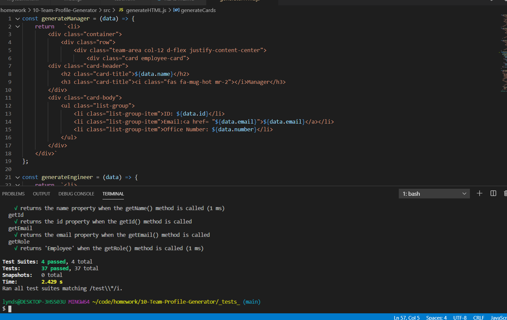
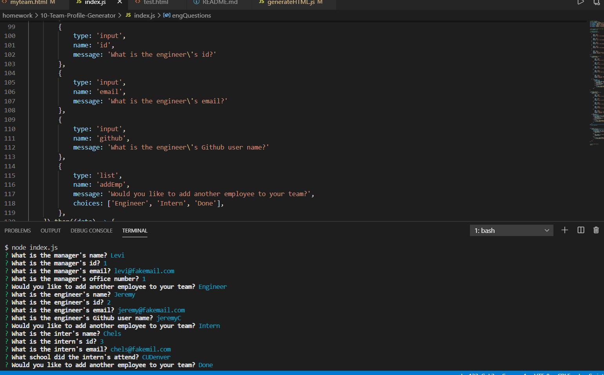

# 10-Team-Profile-Generator

# Description
 I have created a Node.js command-line application for a software engineering team based on the users input. Once user has input all required fields/answered all promted questions, an HTML webpage will be generated with the teams information. All tests have passed and the app is ready to go!

# Table of Contents
1. [Title](Title)
2. [Description](#description)
3. [Installation](#installation)
4. [Usage](#usage)
5. [Contributing](#contribution)
6. [Tests](#tests)
7. [Questions](#questions)
8. [License](#demo)
9. [Demo](#demo)
10. [Screenshot](#screenshot)
# Installation 
I used 'npm i' to insall all required pacakages.
## Usage
User will need to run an npm install and then input 'node index.js' into you their bash/terminal to generate questions.
# Contribution
Myself
# Tests
I used 'npm test' to run tests.

# Questions
## GitHub 
 Lyndseyfin
## Email 
 lyndseyfinamore@gmail.com

## License

## Demo
<a href= "https://www.youtube.com/watch?v=fnr6aPXPzdY">Team Profile Generator Demo</a>

## Screenshot

